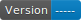

# template-python-package
Template repository for storing, testing, linting, packaging and releasing a python package


## Setup CheckList
- [ ] Pick a name for your package
- [ ] Add Project License
  - [ ] Add License to [LICENSE](./LICENSE)
  - [ ] Uncomment License part of [pyproject.toml](./pyproject.toml)
- [ ] Update [pyproject.toml](./pyproject.toml)
  - [ ] Authors name and email
  - [ ] Package name
  - [ ] Package version
  - [ ] Package short description
  - [ ] keywords
  - [ ] Project Urls
    - [ ] Documentation
    - [ ] Source Code
    - [ ] Issue Tracker
  - [ ] Classifiers
- [ ] Update `README.md`
  - [ ] Update Package name
    - [ ] Title
    - [ ] pip install command
  - [ ] Create description of the project
  - [ ] Update Links
    - [ ] Documentation
    - [ ] Source Code
    - [ ] Issue Tracker
    - [ ] PyPi


<br>
<br>
<br>
<br>


# Package Starter README.md

<br>
<br>


# YOUR PACKAGE NAME
<!-- badges -->




<!-- brief description -->
*Brief description of your package*

## Installation
```bash
pip install YOUR_PACKAGE_NAME
```

## Links
- [Documentation]()
- [Source Code]()
- [Issue Tracker]()
- [PyPi]()

<!-- ## Example Usage
```python
import YOUR_PACKAGE_NAME as pkg

# do something with pkg
``` -->

## Development
### Setup
```bash
bash PackingScripts/SetupVenv.sh
```

### Testing
```bash
bash PackingScripts/PackAndValidate.sh
```


<br>
<br>

#### Made with: <br> [Template Python Package](https://github.com/louie-jones-strong/template-python-package)